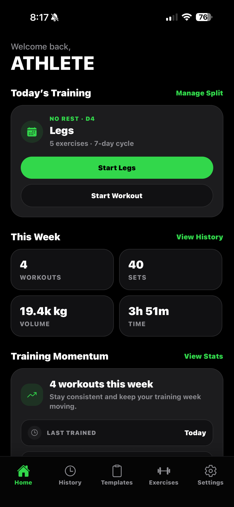
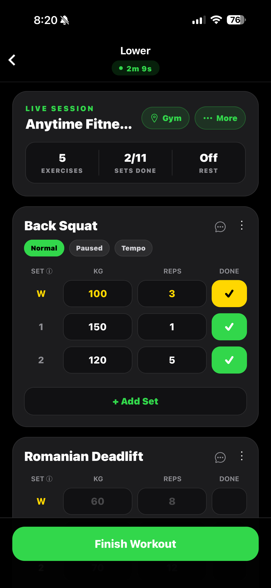
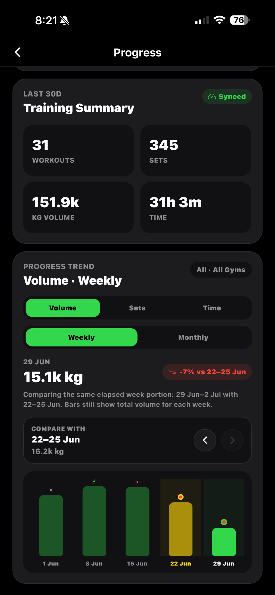
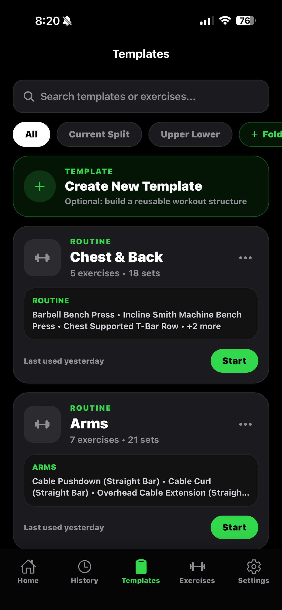
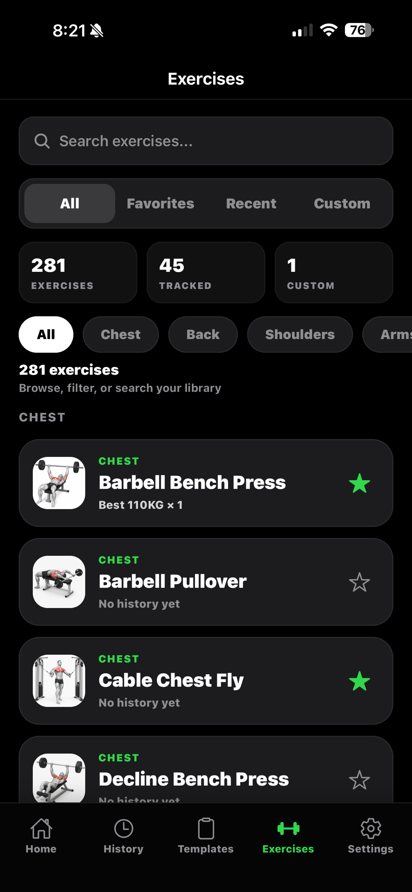
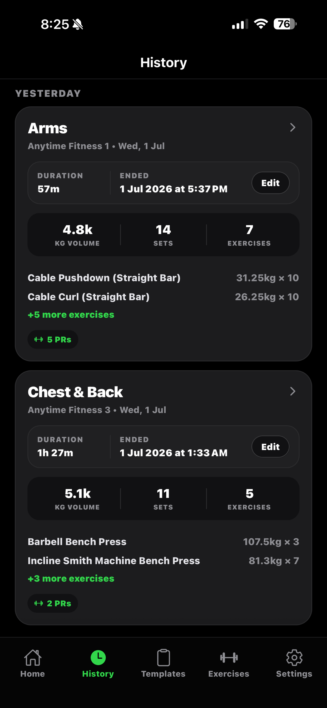

<p align="center">
  
</p>

<h1 align="center">IronVault</h1>

<p align="center">
  A production workout tracker built for fast logging, reusable training plans, and meaningful strength progress.
</p>

<p align="center">
  
  
  
  
</p>

IronVault is an iPhone workout tracker designed around how people actually train in the gym. It combines flexible templates, quick set entry, exercise-specific history, personal records, and optional cloud backup in one focused experience.

## Screenshots

<p align="center">
  
  
  
</p>

<p align="center">
  
  
  
</p>

## Highlights

- Live workout logging with warm-up and working sets, supersets, rest timers, RPE, notes, and plate calculations
- Reusable workout templates with folders, duplication, ordering, variants, and per-gym exercise replacements
- Exercise library with search, filters, favourites, custom exercises, machine brands, and cable attachments
- Position-aware historical weight prefilling that respects exercise, variant, attachment, and machine brand
- Personal records, exercise history, workout history, and weekly or monthly progress trends
- Shareable workout summaries and portable template import/export with validation
- Local persistence for reliable gym use, with authenticated Firebase backup, restore, and synchronisation
- Account lifecycle support including Apple sign-in, email authentication, logout, and account deletion

## Engineering Notes

IronVault is built with React Native and Expo using TypeScript. React Navigation drives the native screen flow, AsyncStorage provides responsive local persistence, and Firebase Authentication and Firestore provide account-based cloud backup.

The app treats local data as the immediate interaction layer so a workout remains usable with an unreliable gym connection. Cloud operations are guarded against repeated submissions, and synchronised collections use stable identifiers and deletion tracking to avoid duplicated or resurrected data.

Firebase client configuration is included because it identifies the public mobile client; access control is enforced by the authenticated data model and the versioned rules in [`firestore.rules`](firestore.rules).

## Project Structure

```text
src/
  components/   Shared interface and feedback components
  constants/    Design tokens, limits, legal text, and static data
  screens/      Application screens and feature flows
  utils/        Persistence, sync, validation, sharing, and calculations
scripts/        Smoke and Firebase rules tests
ironvault-web/  Hosted privacy, support, and account-deletion pages
```

## Local Development

Requirements:

- Node.js 20
- npm
- Xcode for iOS development or Android Studio for Android development
- Expo-compatible simulator, emulator, or physical device

```bash
npm ci
npm start
```

Run the project checks with:

```bash
npm run typecheck
npm run test:smoke
```

Firebase rules tests additionally require the Firebase CLI and Java runtime:

```bash
npm run test:rules
```

## Quality and Safety

- Input limits and validation protect workout, account, and imported-template data
- Loading guards prevent duplicate saves during slow network requests
- Firestore rules scope user-owned data to the authenticated account
- Template imports are schema-validated before anything is added locally
- GitHub Actions runs type-checking and smoke tests on every pull request and push to `main`

## Status

IronVault is a live, independently designed and developed product. This repository is maintained as a technical portfolio and as the source-of-truth for ongoing version control.

Copyright (c) 2026 Junkai. All rights reserved.
